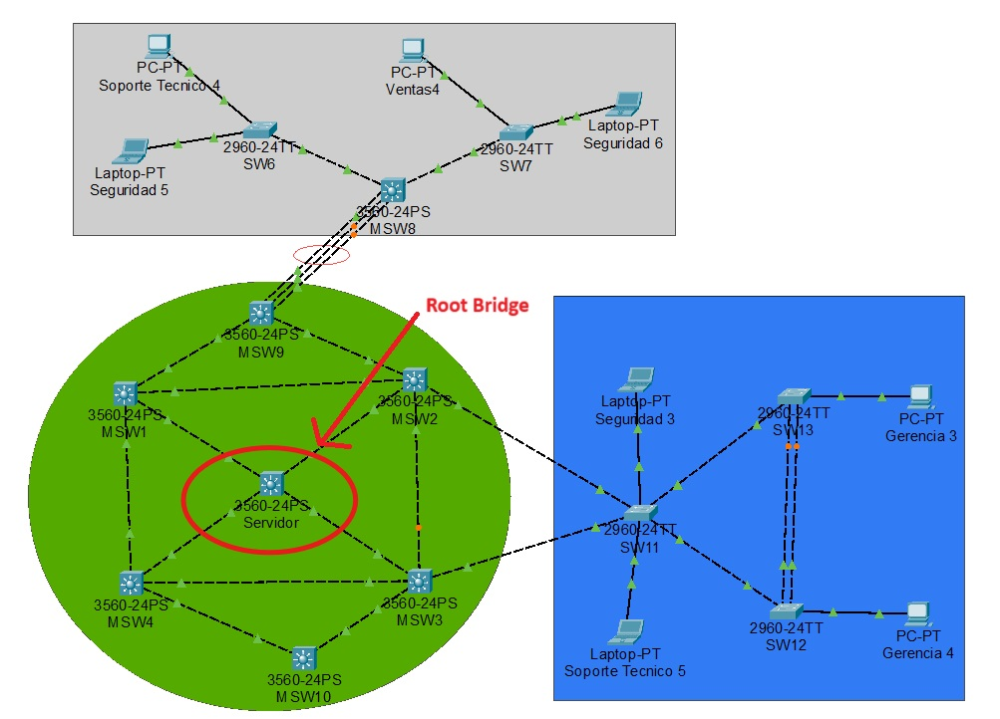

# Documentación de Configuración de STP (Spanning Tree Protocol)

## Introducción
Spanning Tree Protocol (STP) es un protocolo de capa 2 utilizado para evitar bucles en redes Ethernet conmutadas. En esta documentación se describe la configuración del modo de Spanning tree en switches, estableciendo la raíz del spanning-tree para distintas VLANs.

---



## 1. Configuración General de STP
Cada switch debe configurarse con **PVST o Rapid-PVST** como modo de funcionamiento de STP. `Este procedimiento debe aplicarse a todos los switches`.

### Comandos para el modo PVST:
```bash
enable
configure terminal
spanning-tree mode pvst
do w
exit
exit
```

### Comandos para el modo rapid-PVST:
```bash
enable
configure terminal
spanning-tree mode rapid-pvst
do w
exit
exit
```

`Recuerden que deben configurar el modo de STP dependiendo de si su grupo es Par o Impar`


---

## 2. Configuración del Root Bridge

Para mejorar la estabilidad de la red y optimizar la convergencia, se establece un **Root Bridge** para cada VLAN.

### Configuración del Root Bridge para VLANs

```bash
enable
configure terminal
spanning-tree vlan XX root primary
do w
exit
show spanning-tree
exit
```

`Recuerden que este procedimiento se debe hacer por cada VLAN, XX es el numero de vlan correspondiente.`

---

## 3. Verificación de la Configuración

Después de configurar STP y establecer la raíz para cada VLAN, se recomienda verificar el estado del spanning-tree con el siguiente comando:

```bash
show spanning-tree
```

Este comando mostrará información relevante, incluyendo:

- El Root Bridge identificado o el camino para llegar a él.
- Estados de los puertos (Designado, Bloqueado, etc.).
- Costos de los caminos.

Para verificar el modo en que está trabajando STP se utiliza el comando:

```bash
show running-config
```

---
