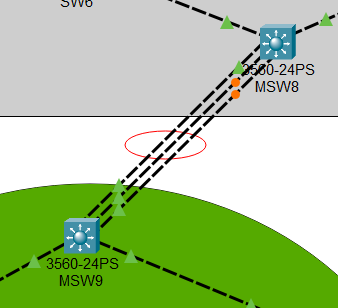

# Configuración de EtherChannel en Switches

## Introducción

EtherChannel es una tecnología de agregación de enlaces utilizada en switches para combinar múltiples enlaces físicos en un solo enlace lógico. Esto proporciona mayor ancho de banda, redundancia y balanceo de carga entre los enlaces.

## Beneficios de EtherChannel

- **Aumento de ancho de banda:** Se combinan múltiples enlaces físicos en un solo enlace lógico.
- **Redundancia:** Si un enlace físico falla, el tráfico se redirige automáticamente a los enlaces restantes.
- **Balanceo de carga:** Distribuye el tráfico entre los enlaces activos, mejorando el rendimiento de la red.
- **Optimización de puertos:** Reduce el uso de STP (Spanning Tree Protocol), ya que el enlace lógico se trata como un solo enlace.

## Modos de Configuración

EtherChannel puede configurarse utilizando dos protocolos principales o en modo estático:

### 1. **PAgP (Port Aggregation Protocol)**

- Propietario de Cisco.
- Modos:

- **Desirable:** Intenta negociar automáticamente EtherChannel con el otro extremo.
- **Auto:** Espera que el otro extremo inicie la negociación.


    | Modo en el primer switch | Modo en el segundo switch | Estado del EtherChannel |
    |--------------------------|--------------------------|--------------------------|
    | **PAgP Desirable**      | **PAgP Desirable**      | Se forma EtherChannel   |
    | **PAgP Desirable**      | **PAgP Auto**           | Se forma EtherChannel   |
    | **PAgP Auto**           | **PAgP Auto**           | No se forma EtherChannel |

### 2. **LACP (Link Aggregation Control Protocol)**

- Estándar IEEE 802.3ad. Lo pueden utilizar distintos fabricantes.
- Modos:
- **Active:** Intenta negociar automáticamente EtherChannel con el otro extremo.
- **Passive:** Espera que el otro extremo inicie la negociación.


    | Modo en el primer switch | Modo en el segundo switch | Estado del EtherChannel |
    |--------------------------|--------------------------|--------------------------|
    | **LACP Active**         | **LACP Active**         | Se forma EtherChannel   |
    | **LACP Active**         | **LACP Passive**        | Se forma EtherChannel   |
    | **LACP Passive**        | **LACP Passive**        | No se forma EtherChannel |

### 3. **Modo Estático (ON)**

- No usa PAgP ni LACP.


    | Modo en el primer switch | Modo en el segundo switch | Estado del EtherChannel |
    |--------------------------|--------------------------|--------------------------|
    | **Modo ON**             | **Modo ON**             | Se forma EtherChannel   |
    | **Modo ON**             | Cualquier otro modo     | No se forma EtherChannel |

## Configuración en Switches Cisco

### **1. Configuración con LACP**

Configuraremos el protocolo LACP y PAGP para los siguientes switches:



- Los enlaces estan conectados a las interfaces fastEthernet 0/10, 0/11 y 0/12 en ambos switches

- #### Configuracion con LACP

Recuerden que para que el portchannel se active los modos de lacp deben **(active <-> active)** o **(active <-> passive)**. En este ejemplo se configura `active` en ambos switches.

- ##### MSW8 - active

```bash
#configuracion del modo troncal de las interfaces
enable
configure terminal
interface range fastEthernet 0/10-12   #aqui recuerden colocar las interfaces que ustedes utilizan
switchport trunk encapsulation dot1q
switchport mode trunk
switchport trunk allowed vlan all

#creación del porthchannel
channel-protocol lacp
channel-group 1 mode active #aqui es donde se configura el modo
do w
exit

#Configuracion del portchannel creado en modo troncal
interface port-channel 1
switchport trunk encapsulation dot1q
switchport mode trunk
switchport trunk allowed vlan all
do w
exit
```

- ###### MSW9 - active

```bash
#configuracion del modo troncal de las interfaces
enable
configure terminal
interface range fastEthernet 0/10-12   #aqui recuerden colocar las interfaces que ustedes utilizan
switchport trunk encapsulation dot1q
switchport mode trunk
switchport trunk allowed vlan all

#creación del porthchannel
channel-protocol lacp
channel-group 1 mode active   #aqui es donde se configura el modo
do w
exit

#Configuracion del portchannel creado en modo troncal
interface port-channel 1
switchport trunk encapsulation dot1q
switchport mode trunk
switchport trunk allowed vlan all
do w
exit
```

### **2. Configuración con PAgP**

Recuerden que para que el portchannel se active los modos de pagp deben ser **(desirable <-> auto)** o **(desirable <-> desirable)**. En este ejemplo se configura un switch en modo `desirable` y otro switch en modo `auto`.

- #### MSW8 - desirable

```bash
#Configuracion de interfaces troncales
enable
configure terminal
interface range fastEthernet 0/10-12 #aqui recuerden colocar las interfaces que ustedes utilizan
switchport trunk encapsulation dot1q
switchport mode trunk
switchport trunk allowed vlan all

#Creación del portchannel
channel-protocol pagp
channel-group 1 mode desirable  #aqui es donde se configura el modo
do w

exit
    
interface port-channel 1
switchport trunk encapsulation dot1q
switchport mode trunk
switchport trunk allowed vlan all
exit
```

- #### MSW9 - auto

```bash
#configuracion del modo troncal de las interfaces
enable
configure terminal
interface range fastEthernet 0/10-12 #aqui recuerden colocar las interfaces que ustedes utilizan
switchport trunk encapsulation dot1q
switchport mode trunk
switchport trunk allowed vlan all

channel-protocol pagp
channel-group 1 mode auto  #aqui es donde se configura el modo
do w


exit
    

interface port-channel 1
switchport trunk encapsulation dot1q
switchport mode trunk
switchport trunk allowed vlan all
exit
```

## Verificación del EtherChannel

Para verificar que EtherChannel está funcionando correctamente, se pueden usar los siguientes comandos:

```bash
show etherchannel summary
show interfaces port-channel 1
show spanning-tree active
```

## Consideraciones

- Ambos extremos deben usar el mismo protocolo (PAgP o LACP).
- Los parámetros de los puertos (velocidad, dúplex, tipo de encapsulación) deben coincidir en ambos extremos.
- EtherChannel no puede combinar puertos de diferentes velocidades o tipos.
