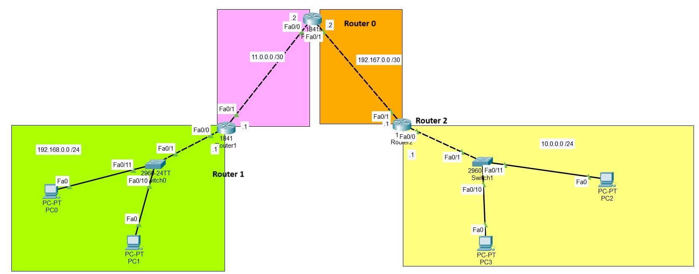

# Manual de Configuración de Enrutamiento Estático

## Introducción

El enrutamiento estático permite definir manualmente las rutas que los paquetes deben seguir para alcanzar redes remotas.Es decir, paquetes que serán enviados fuera de la red local. En este manual, encontrarán un pequeño ejemplo de como configurar rutas estaticas para interconectar redes.

---

## Topología de Red

La topología consta de tres routers conectados en serie y dos redes LAN:

- **Router 1** conecta la red **192.168.0.0/24** con **Router 0** a través del enlace con id de red **11.0.0.0/30**.
- **Router 0** interconecta **Router 1** y **Router 2** mediante la red **192.167.0.0/30**.
- **Router 2** enlaza la red **10.0.0.0/24** con **Router 0**.



---

## Configuración de Direcciones IP

El primer paso es asignar direcciones IP a las interfaces de cada router.

### Router 1
```cisco
enable
configure terminal
interface fastEthernet0/0  
ip address 192.168.0.1 255.255.255.0
no shutdown
exit

interface fastEthernet0/1 
ip address 11.0.0.1 255.255.255.252
no shutdown
exit

end
write memory
```

### Router 0
```cisco
enable
configure terminal
interface fastEthernet0/0  
ip address 11.0.0.2 255.255.255.252
no shutdown
exit

interface fastEthernet0/1 
ip address 192.167.0.2 255.255.255.252
no shutdown
exit

end
write memory
```

### Router 2
```cisco
enable
configure terminal
interface fastEthernet0/0  
ip address 10.0.0.1 255.255.255.0
no shutdown
exit

interface fastEthernet0/1 
ip address 192.167.0.1 255.255.255.252
no shutdown
exit

end
write memory
```

---

## Configuración de Rutas Estáticas

Luego de configurar las direcciones IP, debemos agregar rutas estáticas para garantizar la comunicación entre las redes.

### Router 1
```cisco
enable
configure terminal
ip route 192.167.0.0 255.255.255.252 11.0.0.2
ip route 10.0.0.0 255.255.255.0 11.0.0.2
end
write memory
```

### Router 0
```cisco
enable
configure terminal
ip route 192.168.0.0 255.255.255.0 11.0.0.1
ip route 10.0.0.0 255.255.255.0 192.167.0.1
end
write memory
```

### Router 2
```cisco
enable
configure terminal
ip route 11.0.0.0 255.255.255.252 192.167.0.2
ip route 192.168.0.0 255.255.255.0 192.167.0.2
end
write memory
```

---

## Verificación de la Configuración

Para verificar que las rutas están configuradas correctamente, se usa el siguiente comando:

```cisco
show ip route
```

Recuerden probar la conectividad con **ping**:

```cisco
ping [IP_DESTINO]
```

Por ejemplo, desde **PC0** en la red **192.168.0.0/24**, se prueba conexión con **PC2** en la red **10.0.0.0/24**:

```cisco
ping 10.0.0.2
```

Si la configuración es correcta el ping debe funcionar. Todas las computadoras deben de tener conexion entre ellas.

---