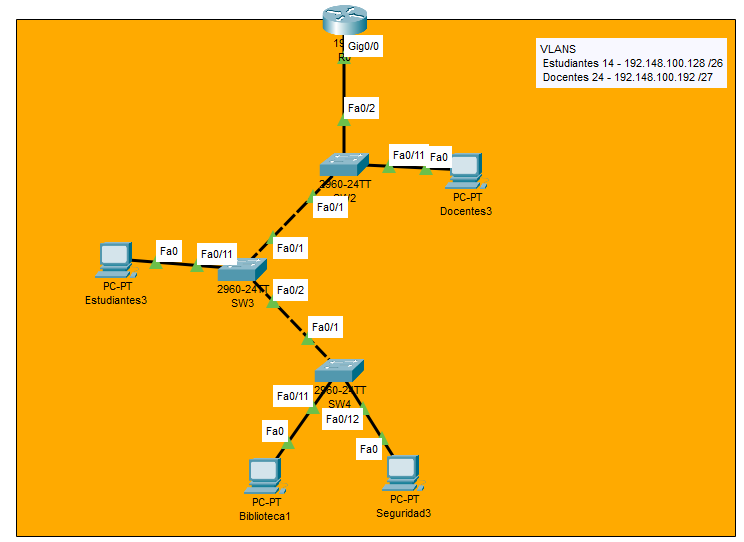

# Documentación de Configuración – Ruteo InterVLAN (Router-on-a-Stick) con VTP

## Topología de Red

PAra este ejemplo se ha implementado una red con 2 VLANs distribuidas en tres switches modelo 2960-24TT y un router para el ruteo interVLAN. Se configuró VTP para la propagación de VLANs y se utilizó Router-on-a-Stick para permitir la comunicación entre VLANs.



## VLANs Utilizadas

| VLAN | Nombre       | Rango de IP              | Máscara            |
|------|--------------|--------------------------|--------------------|
| 14   | Estudiantes  | 192.148.100.128/26       | 255.255.255.192    |
| 24   | Docentes     | 192.148.100.192/27       | 255.255.255.224    |

---

## Configuración del Router (Router-on-a-Stick)

### Subinterfaces

```bash
interface gi0/0
no shutdown
exit

interface gi0/0.14
encapsulation dot1q 14
ip address 192.148.100.129 255.255.255.192
exit

interface gi0/0.24
encapsulation dot1q 24
ip address 192.148.100.193 255.255.255.224
exit
```

---

## Notas Adicionales

- El puerto que conecta a los switches con el router deben ser modo trunk (en este ejemplo es Fa0/2 del SW2).
- El router actúa como gateway para cada VLAN, por lo tanto se crea una subinterfaz para cada VLAN.
- Las PC deben estar configuradas con una IP dentro del rango correspondiente y su puerta de enlace predeterminada debe ser la IP de la subinterfaz del router respectiva.

