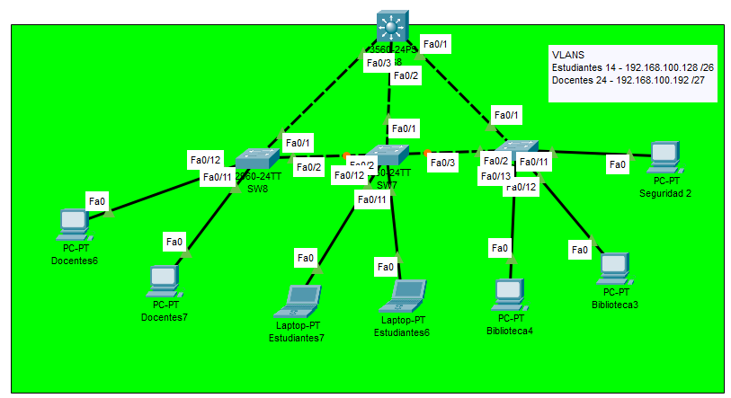

# Ejemplo Ruteo InterVLAN (Router-on-a-Stick) con VTP

## Topología de Red

PAra este ejemplo se ha implementado una red con 2 VLANs distribuidas en tres switches modelo 2960-24TT y un router para el ruteo interVLAN. Se configuró VTP para la propagación de VLANs y se utilizó Router-on-a-Stick para permitir la comunicación entre VLANs.


## VLANs Utilizadas

| VLAN | Nombre       | Rango de IP              | Máscara            |
|------|--------------|--------------------------|--------------------|
| 14   | Estudiantes  | 192.148.100.128/26       | 255.255.255.192    |
| 24   | Docentes     | 192.148.100.192/27       | 255.255.255.224    |

---

## Configuración del Router (Router-on-a-Stick)

### Subinterfaces

```bash
enable
configure terminal

interface gi0/0
no shutdown
exit

interface gi0/0.14    #Creación de la suinterfaz
encapsulation dot1q 14   #Se inidica el protocolo de etiquetado dot1q para la vlan 14
ip address 192.148.100.129 255.255.255.192   #Se asigna una ip a la subinterfaz que servira como default gateway para los dispositivos de la VLAN
exit

interface gi0/0.24
encapsulation dot1q 24
ip address 192.148.100.193 255.255.255.224
exit
```

Asignar una dirección IP a una sub-interfaz permite al router enrutar tráfico entre las distintas VLANs. Esta IP actúa como la puerta de enlace predeterminada (gateway) para los dispositivos dentro de esa VLAN. Con esto el router procesa y reenvia tráfico a otras VLANs.

---

## Notas Adicionales

- El puerto que conecta a los switches con el router deben ser modo trunk (en este ejemplo es Fa0/2 del SW2).
- El router actúa como gateway para cada VLAN, por lo tanto se crea una subinterfaz para cada VLAN.
- Las PC deben estar configuradas con una IP dentro del rango correspondiente y su puerta de enlace predeterminada debe ser la IP de la subinterfaz del router respectiva.

---

# Ejemplo Ruteo InterVLAN con Interfaces Virtuales (SVI)

## Topología de Red

Para este ejemplo se implementa una red con VLANs distribuidas en tres switches modelo 2960-24TT conectados a un switch de capa 3, el cual realiza el ruteo entre VLANs a través de interfaces virtuales (SVIs). Se utiliza VTP para la propagación automática de las VLANs.



## VLANs Utilizadas

| VLAN | Nombre       | Rango de IP              | Máscara            |
|------|--------------|--------------------------|--------------------|
| 14   | Estudiantes  | 192.168.100.128/26       | 255.255.255.192    |
| 24   | Docentes     | 192.168.100.192/27       | 255.255.255.224    |

---

## Configuración de Interfaces Virtuales (SVIs) en el Switch Multicapa

```bash
enable configure terminal

interface vlan 14     #Creacion de la interfaz virtual
ip address 192.168.100.129 255.255.255.192    # Se asigna una ip que servira como defaultgateway para los dispositivos de la vlan
no shutdown   #Habilitamos la interfaz virtual
exit

interface vlan 24
ip address 192.168.100.193 255.255.255.224
no shutdown
exit
```

Asignar una dirección IP a una interfaz VLAN (SVI) permite al switch de capa 3 enrutar tráfico entre las distintas VLANs. Esta IP actúa como la puerta de enlace predeterminada (gateway) para los dispositivos dentro de esa VLAN. Además, permite que el switch procese y reenvíe tráfico a otras VLANs según las reglas de enrutamiento configuradas internamente.

---

## Notas Adicionales

- El switch multicapa debe tener configuradas las VLANS, al igual que todos los demas switches
- Las interfaces VLAN deben estar habilitadas con `no shutdown` para que puedan enrutar el tráfico.
- Las PC deben tener como gateway la dirección IP correspondiente a su VLAN configurada en el switch de capa 3.

