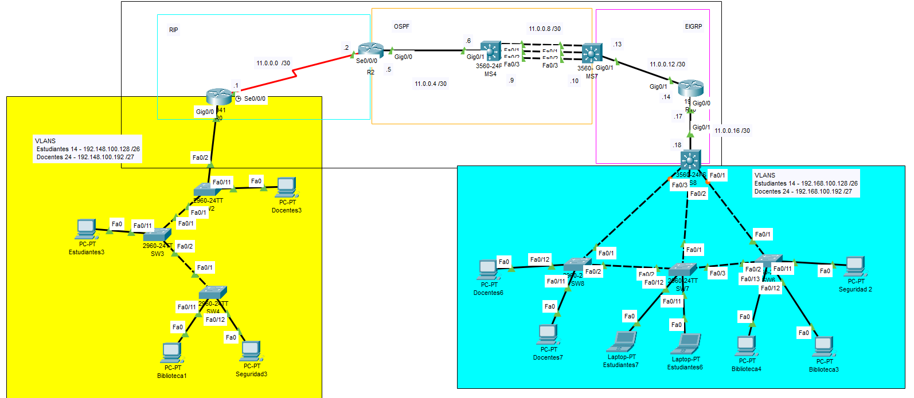

# Enrutamiento Dinámico con RIP, OSPF y EIGRP

## Topología

La topología está dividida en tres dominios principales:
- Zona RIP
- Zona OSPF
- Zona EIGRP 

Se deben asignar IPs a interfaces y redistribución de rutas entre protocolos de enrutamiento

Previamente se debió haber configurado el enrutemiento interVLAN en cada LAN (Sede).



---

## Asignación de Direcciones IP

### R0
```bash
interface se0/0/0
ip address 11.0.0.1 255.255.255.252
no shutdown
```

### R2
```bash
interface se0/0/0
ip address 11.0.0.2 255.255.255.252
no shutdown

interface gi0/0
ip address 11.0.0.5 255.255.255.252
no shutdown
```

### MS4
```bash
interface Gi0/1
no switchport
ip address 11.0.0.6 255.255.255.252
no shutdown

interface port-channel 1
no switchport
ip address 11.0.0.9 255.255.255.252
no shutdown
```

### MS7
```bash
interface port-channel 1
no switchport
ip address 11.0.0.10 255.255.255.252
no shutdown

interface Gi0/1
no switchport
ip address 11.0.0.13 255.255.255.252
no shutdown
```

### R10
```bash
interface gi0/1
ip address 11.0.0.14 255.255.255.252
no shutdown

interface gi0/0
ip address 11.0.0.17 255.255.255.252
no shutdown
```

### MS8
```bash
interface Gi0/1
no switchport
ip address 11.0.0.18 255.255.255.252
no shutdown
```

---

## Configuración de RIP

### R0
```bash
router rip
version 2
network 192.148.100.128
network 192.148.100.192
network 11.0.0.0
no auto-summary
```

### R2
```bash
router rip
version 2
network 11.0.0.0
network 11.0.0.4
no auto-summary
```

---

## Configuración de OSPF

### R2
```bash
router ospf 100
network 11.0.0.0 0.0.0.3 area 0
network 11.0.0.4 0.0.0.3 area 0
```

### MS4
```bash
ip routing
router ospf 100
network 11.0.0.4 0.0.0.3 area 0
network 11.0.0.8 0.0.0.3 area 0
```

### MS7
```bash
ip routing
router ospf 100
network 11.0.0.8 0.0.0.3 area 0
network 11.0.0.12 0.0.0.3 area 0
```

---

## Configuración de EIGRP

### MS7
```bash
ip routing
router eigrp 100
network 11.0.0.8 0.0.0.3
network 11.0.0.12 0.0.0.3
no auto-summary
```

### R10
```bash
router eigrp 100
network 11.0.0.16 0.0.0.3
network 11.0.0.12 0.0.0.3
no auto-summary
```

### MS8
```bash
ip routing
router eigrp 100
network 11.0.0.16 0.0.0.3
network 192.168.100.128 0.0.0.63
network 192.168.100.192 0.0.0.31
no auto-summary
```

---

## Redistribución de Rutas

### R2
```bash
router ospf 100
redistribute rip subnets

router rip
redistribute ospf 100 metric 1
```

### MS7
```bash
router ospf 100
redistribute eigrp 100 subnets

router eigrp 100
redistribute ospf 100 metric 10000 100 255 1 1500
```

---

## Comprobación

Ejecutar los siguientes comandos para verificar:
```bash
show ip route
show ip route ospf
show ip route rip
show ip route eigrp
show ip protocols
show ip interface brief
```

