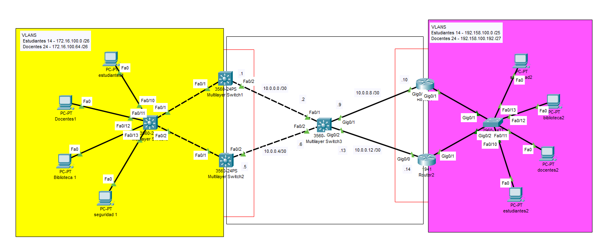

# Redundancia de Default Gateways (Redundancia de Routers)

## Topología General

- VLANs con switches multicapa (Layer 3)
- Enrutamiento dinámico EIGRP
- Redundancia mediante HSRP (Hot Standby Router Protocol)
-Es necesario haber configurado previamente VLANS, VTP, enrutamiento intervlan y enrutamientos dinamicos.



---

## VLANs Utilizadas

| VLAN | Nombre      | Rango de IP             | Máscara             |
|------|-------------|--------------------------|----------------------|
| 14   | Estudiantes | 172.16.100.0             | 255.255.255.192 (/26) |
| 24   | Docentes    | 172.16.100.64            | 255.255.255.192 (/26) |

---

## Configuración de HSRP (Hot Standby Router Protocol)

HSRP permite redundancia entre dos dispositivos enrutadores, creando una "puerta de enlace virtual" compartida por dos equipos.

### MSW1 (Prioridad Alta)

```bash
interface vlan 14
standby 14 ip 172.16.100.1
standby 14 priority 150
standby 14 preempt
no shutdown

interface vlan 24
standby 24 ip 172.16.100.65
standby 24 priority 150
standby 24 preempt
no shutdown
```

### MSW2 (Prioridad Baja)

```bash
interface vlan 14
standby 14 ip 172.16.100.1
standby 14 priority 100
standby 14 preempt
no shutdown

interface vlan 24
standby 24 ip 172.16.100.65
standby 24 priority 100
standby 24 preempt
no shutdown
```

### Router 1

```bash
# Router 1
interface GigabitEthernet0/1.14
standby 14 ip 192.158.100.1
standby 14 priority 150
standby 14 preempt

interface GigabitEthernet0/1.24
standby 24 ip 192.158.100.193
standby 24 priority 150
standby 24 preempt


```

```bash
# Router 2
interface GigabitEthernet0/1.14
standby 14 ip 192.158.100.1
standby 14 priority 100
standby 14 preempt

interface GigabitEthernet0/1.24
standby 24 ip 192.158.100.193
standby 24 priority 100
standby 24 preempt
```

---

## Verificación y Comprobación

Comandos recomendados:
```bash
show standby
```

---

## Notas

Con esta configuración se logra:
- Redundancia de pasarela predeterminada para alta disponibilidad (HSRP)
- Interconectividad eficiente entre VLANs y dominios remotos (EIGRP)
- Flexibilidad y robustez ante caídas de enlaces o dispositivos principales.

## Importante

Los dipositivos deben ser configurados con los default gateways virtuales greados con HSRP